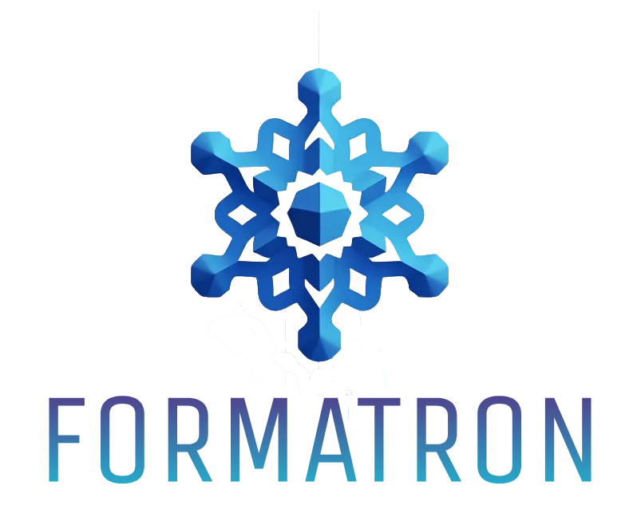

---
Formatron allows users to control the output format of language models
with minimal overhead. It is lightweight, user-friendly,
and seamlessly integrates into existing codebases and frameworks.

## Features

- **🔗 Popular Library Integrations**: Supports transformers and RWKV.
- **🔌 Plugins, not wrappers**:
Instead of wrapping third-party libraries in large, cumbersome classes,
Formatron offers convenient, clean plugins for different libraries.
- **💡 Utilities, not frameworks**:
Instead of unifying everything into a bulky framework,
Formatron provides flexible utilities that can be used anywhere.
- **✍️ Fluent Formatting**: Describe your format as easily as writing natural language.
- **📜 Regex and CFG Support**:
Effortlessly interleave regular expressions and context-free grammars (CFG) in formats.
- **⚙️ Efficient JSON Generation**: Feature-complete JSON generation based on Pydantic models.
- **🚀 Minimal Runtime Overhead**: 
With Leo optimization, a specialized compacting algorithm,
and CFG caches across generations, Earley algorithm implemented in Rust is
the aymptotically and practically fastest algorithms.
Here's a refined version of the bullet point:
- **🔧 Customizable**: Everything is configurable, including schema generation,
grammar generation, and post-generation processing (such as function calls).
## Feature matrix
TODO: create a feature matrix comparing Formatron to other libraries
## Examples
### Quick Start
TODO: make a fancy example that shows off all the powerful features of Formatron
### Function Calls
TODO: show how to call functions in Formatron
### Customize Schema Generation
TODO: show how to customize schema generation
### Customize Grammar Generation
TODO: show how to customize grammar generation
### Customize Post-Generation Processing
TODO: show how to customize post-generation processing
## Integrations
Check out integration examples in the `tests` directory.
## Benchmarks
TODO: show Formatron's speed against other libraries
Here's a refined version of the paragraph:

---

## What Formatron Won't Do
### Implement an End-to-End Inference Pipeline
Every library related to large language models(LLM) must consider that LLMs
are rapidly evolving. Many libraries, such as Guidance, Outlines, and LMQL,
address this by offering their own end-to-end inference pipelines,
which are constantly updated to incorporate the latest techniques. 

Formatron, however, takes a different approach.
Rather than providing a full-fledged inference pipeline,
Formatron focuses on being modular and easily embeddable into existing
and future pipelines.
While this may require users to write a bit more code initially,
it makes maintaining and updating the pipeline in the long run.
### Claim to integrate something that in fact it doesn't
Formatron only considers a library integrated
if all of Formatron's features are supported in the integration.
That's why Formatron doesn't support OpenAI or any remote API-based LLM libraries—
they don't support efficient logits masking per token, nullifying most benefits
of constrained decoding.

## What Formatron Can't Do Now
### Context-Sensitive Validation
Unfortunately, many formats require context-sensitive validation.
For example, two keys in a JSON object must not be equal to each other.
Unlike CFGs, there is no efficient, generic algorithm to validate
such constraints. However, for a specific format, it is possible to validate
them efficiently with a specialized algorithm. In a future release,
Formatron will support context-sensitive validation for popular formats like JSON.

### Abstract Syntax Tree (AST) Construction

Formatron uses an Earley recognizer rather than a parser under the hood.
This approach allows for more efficient generation and validation
but also means that the AST of a given format is not available.
In most cases, this is not a problem,
as it is usually possible to extract the format from the generated string
using simple algorithms and then parse it with a parser.
However, in some cases, obtaining the AST might be necessary.
In a future release, Formatron will support AST construction.